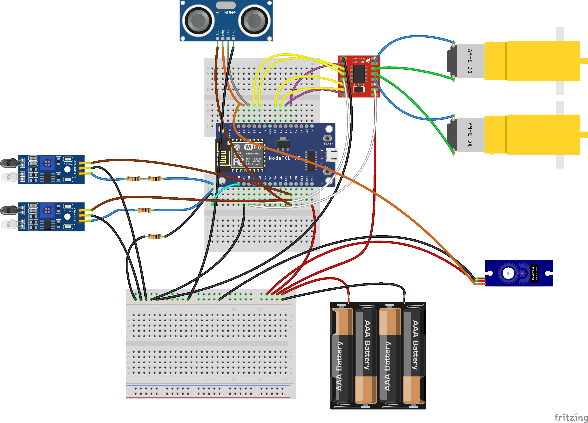

# Hardware — Montagem e Ligações

## Componentes

### Ligados

| Componente | Quantidade | Função |
|------------|:----------:|--------|
| NodeMCU v3 (ESP8266) | 1 | Microcontrolador |
| TB6612FNG (HW-166) | 1 | Driver de motor (ponte H MOSFET) |
| Motor DC 3-6V 200 RPM | 2 | Tração diferencial |
| HC-SR04 | 1 | Sensor ultrassônico |
| Servo SG90 | 1 | Rotaciona o HC-SR04 para varredura L/R |
| HW-201 | 2 | Sensor infravermelho (resistor ladder no ADC) |
| Power Bank GoPro 5V | 1 | Alimentação |

### Desconectados (disponíveis)

- Potenciômetro
- Display 7 segmentos
- Capacitor
- Motor DC 3-6V 200 RPM (reserva)
- HW-201 - Sensor infravermelho (4 disponíveis)

---

## Alimentação

```
Power Bank 5V
  │
  └── Cabo USB cortado
        ├── VERMELHO ── 5V (breadboard +)
        │                ├── NodeMCU VIN
        │                └── TB6612 VM
        │
        └── PRETO    ── GND comum  (breadboard -)
```

| Fonte | Tensão | Alimenta |
|-------|--------|----------|
| NodeMCU VIN | 5V (power bank) | NodeMCU (regulador 3.3V interno) |
| NodeMCU 3V3 | 3.3V | HC-SR04 VCC, HW-201 VCC |
| NodeMCU VU | ~4.7V | TB6612 VCC (lógica) |
| Power Bank (cabo cortado) | 5V | TB6612 VM (motores), **Servo SG90 VCC** |

### Por que 3.3V nos sensores?

HC-SR04 e HW-201 alimentados com **3.3V** em vez de 5V:

| Com 5V | Com 3.3V |
|--------|----------|
| ECHO e OUT = 5V → precisa de divisor de tensão | ECHO e OUT = 3.3V → direto no GPIO ✅ |
| Alcance total do HC-SR04 (~4m) | Alcance reduzido (~2m) |

**Ganho:** sem resistores extras, sem risco de queimar o pino do ESP8266.

---

## Ligações

### ESP8266 (NodeMCU v3)

| Pino | GPIO | Destino | Componente | Fio |
|------|------|---------|------------|-----|
| VIN | — | 5V | Power Bank | Vermelho |
| GND | — | GND | Power Bank | Preto |
| 3V3 | — | VCC, VCC | HC-SR04, HW-201 | Marrom |
| VU | — | VCC, STBY | TB6612FNG | Branco |
| A0 | — | ADC (resistor ladder) | HW-201 (IR_L + IR_R) | Ciano |
| D0 | 16 | Sinal | Servo SG90 | Laranja |
| D1 | 5 | TRIG | HC-SR04 | Laranja |
| D2 | 4 | ECHO | HC-SR04 | Cinza |
| D3 | 0 | BIN1 | TB6612FNG | Amarelo |
| D4 | 2 | BIN2 | TB6612FNG | Amarelo |
| D5 | 14 | AIN1 | TB6612FNG | Amarelo |
| D6 | 12 | AIN2 | TB6612FNG | Amarelo |
| D7 | 13 | PWMA | TB6612FNG | Roxo |
| D8 | 15 | PWMB | TB6612FNG | Roxo |

### TB6612FNG (HW-166)

| Pino TB6612 | Conecta em        | Componente              | Fio      |
| ----------- | ----------------- | ----------------------- | -------- |
| VM          | 5V (cabo cortado) | Power Bank              | Vermelho |
| VCC         | VU (NodeMCU)      | ESP8266                 | Branco   |
| GND         | GND               | Power Bank / breadboard | Preto    |
| STBY        | VU (NodeMCU)      | ESP8266                 | Branco   |
| A01         | Motor A fio 1     | Motor DC 1              | Azul     |
| A02         | Motor A fio 2     | Motor DC 1              | Verde    |
| B01         | Motor B fio 1     | Motor DC 2              | Azul     |
| B02         | Motor B fio 2     | Motor DC 2              | Verde    |
| AIN1        | D5                | ESP8266                 | Amarelo  |
| AIN2        | D6                | ESP8266                 | Amarelo  |
| PWMA        | D7                | ESP8266                 | Roxo     |
| BIN1        | D3                | ESP8266                 | Amarelo  |
| BIN2        | D4                | ESP8266                 | Amarelo  |
| PWMB        | D8                | ESP8266                 | Roxo     |

### Servo SG90

| Fio | Pino do servo | Conecta em | Por quê |
|-----|:-------------:|------------|---------|
| Vermelho | **VCC** (alimentação) | **Power Bank 5V** (cabo cortado) | Motor precisa de 5V — NodeMCU não aguenta a corrente (~700mA em stall) |
| Marrom | **GND** | **GND** comum | Terra |
| Laranja | **Sinal** (PWM) | **NodeMCU D0** (GPIO 16) | Sinal PWM em 3.3V — SG90 aceita este nível mesmo com VCC em 5V |

**Resumo:**
- **Alimentação:** 5V do cabo cortado (mesmo ramo do TB6612 VM)
- **Sinal:** D0 (GPIO 16) — 3.3V do ESP8266, compatível com o servo
- **Nunca** ligue o VCC do servo no 3V3 ou VU do NodeMCU

### HC-SR04

| Pino | Conecta em | Fio |
|------|------------|-----|
| VCC | NodeMCU 3V3 | Marrom |
| GND | GND | Preto |
| TRIG | NodeMCU D1 | Laranja |
| ECHO | NodeMCU D2 | Cinza |

### HW-201 (resistor ladder)

Os dois sensores são conectados a um **resistor ladder** no ADC:

```
      3.3V
        │
        ├── IR_L VCC      ├── IR_R VCC
        │                  │
        ├── IR_L OUT ── 10kΩ ──┐
        │                      │
        ├── IR_R OUT ── 20kΩ ──┤
        │                      │
        └── GND      ── 10kΩ ──┤
                               │
                          NodeMCU A0
```

| Componente | Valores |
|------------|---------|
| R1 (IR_L → A0) | 10kΩ (marrom-preto-laranja) |
| R2 (IR_R → A0) | 20kΩ (vermelho-preto-laranja, ou 2×10k em série) |
| R3 (GND → A0) | 10kΩ (marrom-preto-laranja) |

| Sensor | Pino | Conecta em |
|--------|------|------------|
| HW-201 #1 (IR_L) | VCC | NodeMCU 3V3 |
| | GND | GND |
| | OUT | 10kΩ → A0 |
| HW-201 #2 (IR_R) | VCC | NodeMCU 3V3 |
| | GND | GND |
| | OUT | 20kΩ → A0 |

---

## Segurança no Boot

Durante o boot do ESP8266, alguns GPIOs têm comportamento especial:

| GPIO | Pino | Estado boot | Efeito no TB6612 |
|------|------|-------------|-------------------|
| 0 | D3 | Pullup HIGH | BIN1=HIGH + BIN2=HIGH = freio |
| 2 | D4 | Pullup HIGH | BIN1=HIGH + BIN2=HIGH = freio |
| 15 | D8 | Pulldown LOW | PWMB=0 → motor B desligado ✓ |

**Resultado:** os dois motores ficam desligados durante o boot.
Nenhum movimento involuntário.

---

## Segurança Elétrica

| Verificação | OK? |
|-------------|:---:|
| HC-SR04 VCC no **3V3**, não no 5V | ⚠️ |
| Servo SG90 VCC no **5V (cabo cortado)**, não no 3V3 ou VU | ⚠️ |
| HW-201 VCC no **3V3**, não no 5V | ⚠️ |
| Resistor ladder montado: IR_L=10kΩ, IR_R=20kΩ, GND=10kΩ | ⚠️ |
| STBY jumper no **VCC** (TB6612 funcionar) | ⚠️ |
| GND power bank = GND NodeMCU = GND TB6612 (comum) | ⚠️ |
| VM no cabo cortado, **não** no VU | ⚠️ |

Verifique antes de ligar a energia.

---

## Esquema Visual



> Esquema visual dos componentes — feito no Fritzing.
